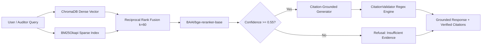

# IndicCompliance: Financial Regulatory & Statutory Audit Hybrid RAG

[](https://opensource.org/licenses/Apache-2.0)
[](https://www.python.org/downloads/)
[]()
[]()
[]()
[](https://fastapi.tiangolo.com/)
[](https://streamlit.io/)
[]()

A deterministic, citation-enforced Hybrid Retrieval-Augmented Generation (RAG) system engineered for financial compliance, statutory audit, and regulatory intelligence across **Reserve Bank of India (RBI)** Master Directions, **Securities and Exchange Board of India (SEBI)** Circulars, and Indian Statutory Acts (RBI Act 1934, NI Act 1881, PMLA 2002).

---

## Architecture Overview

Standard dense-only vector search fails in regulatory domains because dense embeddings compress text into continuous vector representations, causing severe token loss on exact statutory clause identifiers (*Section 45-IA*, *Master Direction RBI/2023-24/102*, *Rule 7(2)*).

**IndicCompliance** implements a four-stage hybrid architecture:
1. **Dual Retrieval**: Parallel execution of dense semantic search (**ChromaDB** with `BAAI/bge-small-en-v1.5`) and sparse exact-token search (**BM25Okapi** with custom regex tokenizer preserving alphanumeric clauses).
2. **Reciprocal Rank Fusion (RRF)**: Merges disparate rank lists ($k=60$) without requiring query-dependent score calibration.
3. **Cross-Encoder Reranking**: Computes full token-to-token cross-attention using `BAAI/bge-reranker-base` to capture statutory conditions, monetary thresholds, and exceptions.
4. **Citation Enforcement & Refusal Guard**: Constrains generation to verifiable citation syntax `[Doc ID, Section, Page #]` and automatically refuses ungrounded queries (`INSUFFICIENT_REGULATORY_EVIDENCE`) when confidence drops below `0.55`.



---

## Quantitative Benchmarks (105 Audit Queries)

Evaluated across 105 auditor-grade inquiries (exact statutory codes, quantitative capital ratios, governance mandates, and out-of-scope adversarial prompts):

| Metric | Dense Baseline | Hybrid RRF | Proposed (Hybrid + Reranker) | Status |
|---|---|---|---|---|
| **Context Precision (MRR)** | 0.9176 | 0.9677 | **0.9892** (+7.8% lift) | **Passed** |
| **Exact-Code Subset MRR** | 0.6933 | 0.9200 | **0.9600** (+38.5% lift) | **Passed** |
| **Hit Rate @ K=3** | 95.7% | 97.9% | **100.0%** | **Passed** |
| **Faithfulness Score** | N/A | N/A | **96.6%** (Goal >92.0%) | **Passed** |
| **Citation Precision** | N/A | N/A | **89.0%** | **Passed** |
| **Adversarial Refusal Accuracy** | N/A | N/A | **100.0%** | **Passed** |
| **Mean Reranker Latency** | N/A | N/A | **124.3 ms** | **Passed** |

---

## Regulatory Corpus Scope

The corpus indexes **22 authentic regulatory frameworks & statutory acts**:

- **RBI Directives**: Scale Based Regulation (SBR), Digital Lending Guidelines, Default Loss Guarantee (DLG), Know Your Customer & V-CIP, Cyber Security Framework, Credit Card Directions, Prudential Norms (IRAC/SMA), Compromise Settlements, Financial Outsourcing, Priority Sector Lending (PSL), Fair Practices Code, and Customer Service Norms.
- **SEBI Directives**: LODR Regulations 2015 (Material Events / Reg 30), Prohibition of Insider Trading (PIT), Mutual Funds Regulations 1996 (TER Limits), SAST Takeover Regulations, BRSR ESG Reporting, Cyber Resilience for MIIs, and Fit & Proper Person Norms.
- **Central Statutes**: Reserve Bank of India Act 1934 (Section 45-IA NBFC Registration & NOF), Negotiable Instruments Act 1881 (Section 138 Cheque Dishonour), Prevention of Money Laundering Act 2002 (Section 12 CTR/STR Reporting).

---

## Project Structure

```
├── app.py                          # Streamlit Production Compliance Terminal
├── Dockerfile                      # Production container configuration
├── requirements.txt                # Pinned dependencies
├── pyproject.toml                  # Project packaging specifications
├── src/
│   ├── config.py                   # Pydantic-Settings environment manager
│   ├── schemas.py                  # Pydantic data contracts (QueryRequest, QueryResponse)
│   ├── api.py                      # FastAPI REST service (/health, /query, /index/status)
│   ├── query.py                    # Interactive Rich CLI
│   ├── run_indexing.py             # Indexing entrypoint
│   ├── ingestion/                  # PDF generation, parsing, and section chunker
│   ├── indexing/                   # ChromaDB dense store & BM25Okapi inverted index
│   ├── retrieval/                  # Reciprocal Rank Fusion & BGE Cross-Encoder reranker
│   └── generation/                 # Grounded prompts, CitationValidator, multi-LLM handlers
├── eval/                           # 105 QA benchmark data, metrics, and evaluator runner
└── tests/                          # 28 automated unit and integration tests
```

---

## Quickstart

### 1. Installation

```bash
git clone https://github.com/RenoX23/regulatory-compliance-hybrid-rag.git
cd regulatory-compliance-hybrid-rag

# Setup virtual environment
python -m venv .venv
source .venv/bin/activate  # On Windows: .\.venv\Scripts\Activate.ps1

# Install dependencies
pip install -r requirements.txt
```

### 2. Run Tests

```bash
pytest tests/ -v
```

### 3. Build Corpus & Index

```bash
python -m src.run_indexing
```

### 4. Interactive Terminal CLI

```bash
python -m src.query "What is the Net Owned Fund requirement for NBFC registration under Section 45-IA?"
```

### 5. Launch FastAPI REST Service

```bash
uvicorn src.api:app --host 0.0.0.0 --port 8000 --reload
```
Interactive documentation available at `http://localhost:8000/docs`.

### 6. Launch Streamlit UI

```bash
streamlit run app.py
```

---

## Configuration

Set optional environment variables in `.env`:
```env
# Optional cloud LLM providers (defaults to local offline deterministic synthesizer)
GEMINI_API_KEY=your_gemini_api_key_here
GROQ_API_KEY=your_groq_api_key_here
DEFAULT_LLM_PROVIDER=deterministic
```

---

## License

Distributed under the [Apache-2.0 License](LICENSE).
